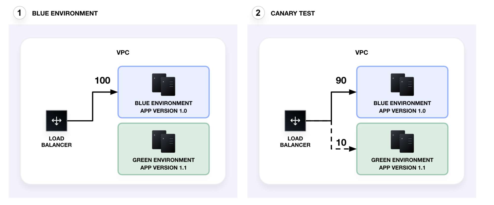

# canaryandrolling

# Description

This terraform configuration is used to create the network of [this server](https://github.com/adadeeeh/canaryandrolling-app) and this terraform state will be shared to the workspace above. This network is used to test canary and rolling deployment.

# Configuration

1. Use Terraform Cloud as the backend. Create new workspace and create environment variables `AWS_ACCESS_KEY_ID` and `AWS_SECRET_ACCESS_KEY`.
2. Create github actions for Terraform.
3. Create github secrets `GITHUB_TOKEN`.
4. For production used, create branch rule to protect main branch and enable require status checks to pass before merging.
5. Allow remote state access by navigating to "Settings" page, under "General" tab. Scroll to the "remote state sharing" section.
6. Edit variavle `traffic_distribution` according to `traffic_dist_map` to to configure the load balancer weight.

# References

1. https://learn.hashicorp.com/tutorials/terraform/blue-green-canary-tests-deployments?in=terraform/applications
2. https://learn.hashicorp.com/tutorials/terraform/github-actions
3. https://learn.hashicorp.com/tutorials/terraform/cloud-run-triggers
